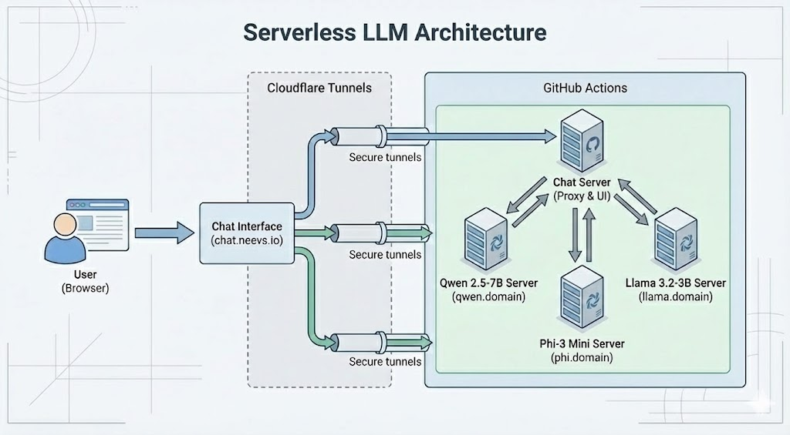

# Serverless LLM

[](https://qwen.neevs.io/health)
[](https://r1qwen.neevs.io/health)
[](https://gemma.neevs.io/health)
[](https://mistral.neevs.io/health)
[](https://phi.neevs.io/health)
[](https://rnj.neevs.io/health)
[](https://llama.neevs.io/health)
[](https://functiongemma.neevs.io/health)

<!-- Live API Health Status -->
[](https://chat.neevs.io/status)

## Overview

Serverless LLM inference on GitHub Actions free tier (unlimited minutes for public repos) with public access via Cloudflare Tunnels.

Allows experimentation with multiple AI interaction patterns: side-by-side comparison, collaborative discussion, multi-agent orchestration, and output variations.

- **Zero Infrastructure Cost**: Runs on GitHub Actions free tier (unlimited minutes for public repos)
- **Multi-Model Support**: 8 models ranked by capability (see table below)
- **High Availability**: Run 1-3 parallel instances per model for zero-downtime restarts and load balancing
- **Model Caching**: GGUF models cached between runs for fast restarts
- **Continuous Availability**: Auto-restart with graceful handoff
- **Public Access**: External connectivity via Cloudflare Tunnels

## Architecture



## Models

Models ranked by overall capability based on Dec 2025 benchmarks (MMLU-Pro, GPQA, MATH, HumanEval):

| Rank | Model | Size | Key Strengths | Best For |
|:-----|:------|:-----|:--------------|:---------|
| 1 | **Qwen3 4B** | 4B | Multilingual (119 langs), long-context (1M tokens), reasoning, coding, agent capabilities | Complex reasoning, code generation, agent tasks |
| 2 | **DeepSeek R1 1.5B** | 1.5B | Math/reasoning (o1-preview level), efficient CoT, coding (96.3% Codeforces) | Step-by-step reasoning, math problems, algorithms |
| 3 | **Gemma 2 9B** | 9B | On-device efficiency, reasoning, responsible AI, safety-aligned | Fact-checking, educational content, safe generation |
| 4 | **Mistral 7B v0.3** | 7B | Instruction-following, structured output, function calling | JSON generation, tool use, task decomposition |
| 5 | **Phi-3 Mini** | 3.8B | Compact reasoning, synthetic data efficiency, instruction following | Logic puzzles, moderate difficulty tasks |
| 6 | **RNJ-1 Instruct** | 8B | Tool-calling, agentic capabilities (70% SWE-Bench) | Automation workflows, tool use |
| 7 | **Llama 3.2 3B** | 3B | Lightweight chat, creative writing, long context (131K) | Casual conversation, summarization, storytelling |
| 8 | **FunctionGemma 270M** | 270M | Function calling specialist, edge-optimized, action execution | Edge device agents, mobile actions, API automation, offline function calling |

## Quick Start

**Setup overview**: Fork this repo, configure GitHub secrets and Cloudflare Tunnels, then trigger the workflows.

### 1. Configure GitHub Secrets

Add to **Settings > Secrets and variables > Actions**:

| Secret | Description |
|--------|-------------|
| `HF_TOKEN` | Hugging Face token for gated models |
| `TUNNELS_JSON` | **Recommended:** Single JSON secret containing all tunnel tokens (see [Tunnel Automation](.docs/TUNNEL_AUTOMATION.md)) |
| `CLOUDFLARE_TUNNEL_TOKEN_{MODEL}` | **Legacy:** Individual tunnel tokens (QWEN, PHI, LLAMA, MISTRAL, GEMMA, R1QWEN, RNJ, FUNCTIONGEMMA) - not needed if using TUNNELS_JSON |
| `CLOUDFLARE_TUNNEL_TOKEN_CHAT` | Tunnel token for web interface |
| `{MODEL}_API_URL` | Public URL for each model (e.g., `https://qwen.neevs.io`) |
| `GH_MODELS_TOKEN` | **[OPTIONAL]** GitHub token for Discussion/Agents modes. Default uses free quota ([create your own](https://github.com/settings/personal-access-tokens/new)) |
| `WORKFLOW_PAT` | GitHub Personal Access Token with `repo` scope for auto-restart functionality |

### 2. Create Cloudflare Tunnels

**Automated (Recommended):**
1. Add GitHub Secrets: `CLOUDFLARE_API_TOKEN`, `CLOUDFLARE_ACCOUNT_ID`
2. Run: `python scripts/setup_tunnels.py --domain yourdomain.com`
3. Copy output JSON to GitHub Secret: `TUNNELS_JSON`

**Manual:**
Create tunnels in Cloudflare Zero Trust dashboard and add tokens to GitHub Secrets.

See [Tunnel Automation](.docs/TUNNEL_AUTOMATION.md) for details.

## API

### Endpoints

Each model exposes OpenAI-compatible endpoints:

| Endpoint | Method | Description |
|----------|--------|-------------|
| `/health` | GET | Health check and model status |
| `/v1/models` | GET | List available models |
| `/v1/chat/completions` | POST | Chat completion (streaming supported) |

### Example Request

```bash
curl -X POST <YOUR_MODEL_API_URL>/v1/chat/completions \
  -H "Content-Type: application/json" \
  -d '{
    "messages": [{"role": "user", "content": "Explain quantum computing"}],
    "max_tokens": 512,
    "temperature": 0.7,
    "stream": true
  }'
```

### Performance Debugging

- Check runtime settings via `GET /health/details` (includes `n_ctx`, `n_threads`, `n_batch`, `max_concurrent`)
- Add `"include_perf": true` to `/v1/chat/completions` to return queue/compute timing (and TTFT for streaming)
- Compare models with `python3 scripts/bench_models.py --models qwen phi llama --stream --include-perf`

## Project Structure

```
serverless-llm/
├── .github/workflows/          # GitHub Actions workflows for each model + interface
├── app/
│   ├── qwen-inference/         # Qwen3 4B model server
│   ├── deepseek-r1qwen-inference/ # DeepSeek R1 Qwen 1.5B model server
│   ├── gemma-inference/        # Gemma 2 9B model server
│   ├── mistral-inference/      # Mistral 7B model server
│   ├── phi-inference/          # Phi-3 Mini model server
│   ├── rnj-inference/          # RNJ-1 Instruct model server
│   ├── llama-inference/        # Llama 3.2 3B model server
│   ├── functiongemma-inference/ # FunctionGemma 270M model server
│   └── chat-interface/         # Web interface + API proxy
├── config/                     # Centralized configuration
│   └── models.py               # Model ports and metadata
├── scripts/                    # Automation scripts
│   ├── setup_tunnels.py        # Cloudflare tunnel automation
│   └── get_tunnel_token.py     # Token retrieval utility
└── README.md
```

## Technologies

| Component | Technology |
|-----------|------------|
| Compute | GitHub Actions |
| LLM Runtime | llama-cpp-python (GGUF) |
| API Framework | FastAPI |
| Streaming | Server-Sent Events |
| Tunneling | Cloudflare Zero Trust |
| Caching | GitHub Actions Cache (models) |
| Frontend | Vanilla JS + marked.js |

## Configuration

**High Availability**: Run multiple parallel instances per model:
- Each workflow supports 1-3 concurrent instances
- Cloudflare Tunnels load-balance across active instances
- Zero-downtime during restarts with multiple instances

**Auto-Restart**: Workflows restart before GitHub's 6-hour limit:
- Default runtime: 5.5 hours
- Auto-restart triggers new workflow via repository dispatch
- New instance starts before old one stops (graceful handoff)

## Local Development

Run models and the web interface locally without GitHub Actions.

### Prerequisites

```bash
pip install -r app/qwen-inference/requirements.txt
```

### Port Scheme (Local Development)

For local development with multiple models on the same machine:

| Range | Category | Models |
|-------|----------|--------|
| 8080 | Core | Chat Interface |
| 81XX | Small (<7B) | qwen (8100), phi (8101), functiongemma (8103) |
| 82XX | Medium (7B-30B) | gemma (8200), llama (8201), mistral (8202), rnj (8203) |
| 83XX | Reasoning | r1qwen (8300) |

GitHub Actions uses port 8000 for all inference models (each runs on a separate runner).

See `config/models.py` for the authoritative configuration.

### Start a Model Server

```bash
cd app/qwen-inference
python inference_server.py  # Runs on port 8100
```

### Start the Web Interface

```bash
cd app/chat-interface
export QWEN_API_URL=http://localhost:8100
export GH_MODELS_TOKEN=ghp_xxxxxxxxxxxxx  # Optional
python chat_server.py  # Runs on port 8080
```

### Run with Docker Compose

```bash
# Chat interface only
docker-compose up

# Chat + specific models
docker-compose --profile qwen --profile phi up

# All services
docker-compose --profile all up
```

## Limitations

- **CPU Inference**: No GPU on GitHub-hosted runners (slower generation)
- **Brief Downtime**: ~3-5 minutes during auto-restart (only with single instance; eliminated with 2+ instances)
- **First Run**: Initial model download (~2-5 min), subsequent runs use cached models

## License

MIT License - see [LICENSE](LICENSE) for details
