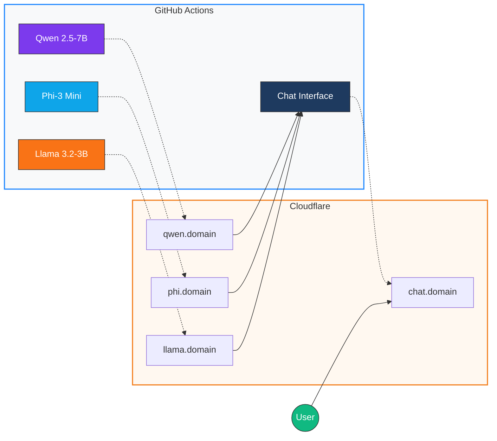

# Serverless LLM Arena

[](https://github.com/features/actions)
[](https://cloudflare.com/)
[](https://fastapi.tiangolo.com/)
[](https://python.org/)
[](https://github.com/ggerganov/llama.cpp)

**Run LLM inference servers on GitHub Actions free tier with public access via Cloudflare Tunnels.**

Compare responses from multiple AI models side-by-side with real-time streaming in a modern web interface.

## Overview

- **Zero Infrastructure Cost**: Runs entirely on GitHub Actions free tier
- **Multi-Model Comparison**: Query Qwen, Phi, and Llama models simultaneously
- **Real-Time Streaming**: Server-Sent Events deliver tokens as they're generated
- **Public Access**: Cloudflare Tunnels expose services without port forwarding
- **Auto-Restart**: Maintains continuous availability across GitHub's 6-hour limit

## Architecture



## Features

### LLM Arena Interface

Compare AI model responses side-by-side:

- **Multi-Select Models**: Choose one or multiple models per query
- **Real-Time Streaming**: Watch responses appear token-by-token
- **Performance Metrics**: Response time and token count per model
- **Markdown Rendering**: Code blocks, lists, tables, and formatting
- **Dark/Light Mode**: Automatic theme support
- **Mobile Responsive**: Works on all device sizes

### OpenAI-Compatible API

Each model server exposes standard endpoints:

| Endpoint | Method | Description |
|----------|--------|-------------|
| `/health` | GET | Health check |
| `/v1/models` | GET | List available models |
| `/v1/chat/completions` | POST | Chat completion (streaming supported) |

```bash
curl -X POST https://qwen.your.domain/v1/chat/completions \
  -H "Content-Type: application/json" \
  -d '{
    "messages": [{"role": "user", "content": "Explain quantum computing"}],
    "max_tokens": 512,
    "temperature": 0.7,
    "stream": true
  }'
```

## Quick Start

### 1. Configure Secrets

Add to **Settings > Secrets and variables > Actions**:

| Secret | Description |
|--------|-------------|
| `HF_TOKEN` | Hugging Face token (for gated models) |
| `CLOUDFLARE_TUNNEL_TOKEN_QWEN` | Tunnel token for Qwen server |
| `CLOUDFLARE_TUNNEL_TOKEN_PHI` | Tunnel token for Phi server |
| `CLOUDFLARE_TUNNEL_TOKEN_LLAMA` | Tunnel token for Llama server |
| `CLOUDFLARE_TUNNEL_TOKEN_CHAT` | Tunnel token for chat interface |
| `QWEN_API_URL` | Public URL (e.g., `https://qwen.domain`) |
| `PHI_API_URL` | Public URL for Phi |
| `LLAMA_API_URL` | Public URL for Llama |

### 2. Create Cloudflare Tunnels

1. Go to [Cloudflare Zero Trust](https://one.dash.cloudflare.com/)
2. Navigate to **Access > Tunnels**
3. Create 4 tunnels routing to `http://localhost:8000` (models) and `:8080` (chat)
4. Copy tokens to GitHub secrets

### 3. Run Workflows

**GitHub UI:**
1. Go to **Actions** tab
2. Select workflow → **Run workflow**

**GitHub CLI:**
```bash
# Start all services
gh workflow run qwen-inference.yml
gh workflow run phi-inference.yml
gh workflow run llama-inference.yml
gh workflow run chat-interface.yml
```

## Project Structure

```
serverless-llm/
├── .github/workflows/
│   ├── qwen-inference.yml       # Qwen model server
│   ├── phi-inference.yml        # Phi model server
│   ├── llama-inference.yml      # Llama model server
│   └── chat-interface.yml       # Web UI service
│
├── app/
│   ├── qwen-inference/
│   │   └── inference_server.py  # FastAPI + llama-cpp-python
│   ├── phi-inference/
│   │   └── inference_server.py
│   ├── llama-inference/
│   │   └── inference_server.py
│   └── chat-interface/
│       └── chat_server.py       # Arena UI + streaming proxy
│
└── README.md
```

## Technologies

| Category | Technology |
|----------|------------|
| Compute | GitHub Actions |
| LLM Runtime | llama-cpp-python (GGUF) |
| API Framework | FastAPI |
| Streaming | Server-Sent Events |
| Tunneling | Cloudflare Zero Trust |
| Frontend | Vanilla JS + marked.js |

## Models

| Model | Parameters | Quantization | Use Case |
|-------|------------|--------------|----------|
| Qwen 2.5 | 7B | Q4_K_M | General purpose, coding |
| Phi-3 Mini | 3.8B | Q4_K_M | Reasoning, instruction following |
| Llama 3.2 | 3B | Q4_K_M | Chat, creative writing |

## Configuration

### Workflow Inputs

| Input | Default | Description |
|-------|---------|-------------|
| `duration_hours` | 5.5 | Runtime before auto-restart |
| `auto_restart` | true | Restart before GitHub timeout |

### Auto-Restart

Workflows automatically restart before GitHub's 6-hour limit:
1. Runs for configured duration (default 5.5h)
2. Triggers repository dispatch event
3. New workflow starts automatically
4. ~3-5 minutes downtime during transition

## Limitations

- **CPU Inference**: GitHub-hosted runners are CPU-only (slower responses)
- **6-Hour Limit**: Maximum single job duration
- **Cold Start**: Models download on each run (~2-5 min startup)
- **Rate Limits**: GitHub Actions has usage limits on free tier

## Local Development

```bash
# Install dependencies
pip install -r app/qwen-inference/requirements.txt

# Start a model server
cd app/qwen-inference && python inference_server.py

# Start chat interface (separate terminal)
cd app/chat-interface
export QWEN_API_URL=http://localhost:8001
export PHI_API_URL=http://localhost:8002
export LLAMA_API_URL=http://localhost:8003
python chat_server.py
```

## License

MIT License - see [LICENSE](LICENSE)
